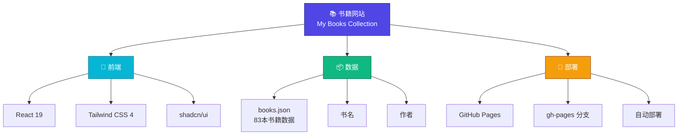
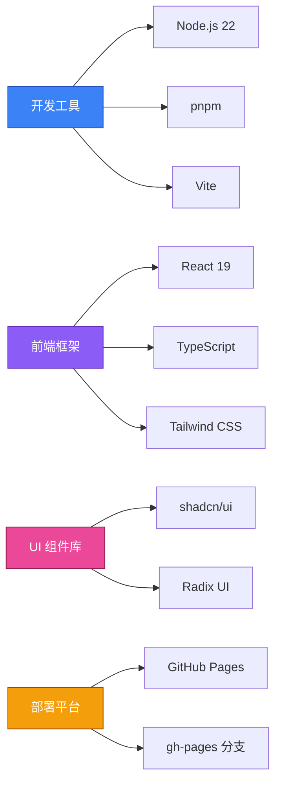
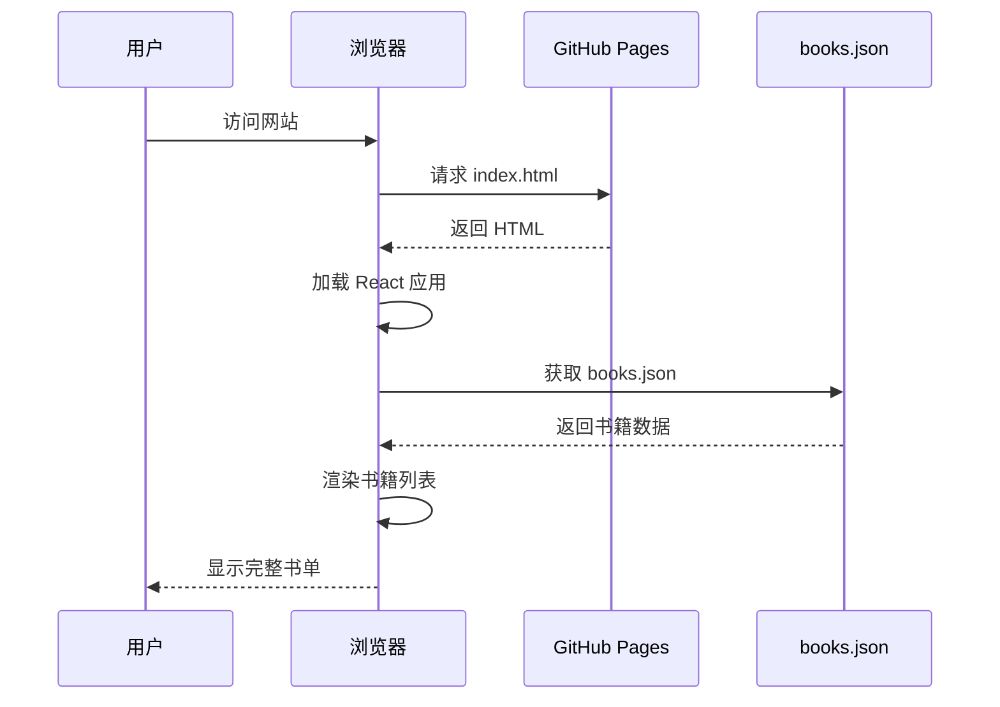

# 📚 我的书单 - My Books Collection

一个最简化的书籍展示网站，用于展示个人书单。网站仅显示书名和作者信息，界面简洁清爽。

## 🌐 在线访问

👉 **[访问网站](https://Co1m.github.io/books/)**

## 📊 项目结构



## 🎯 功能特性

- **📖 书籍展示** - 展示 83 本书籍，包含书名和作者信息
- **🎨 简洁设计** - 最小化界面，专注于内容
- **📱 响应式** - 支持桌面、平板和移动设备
- **⚡ 快速加载** - 由 GitHub Pages 提供高速访问
- **🔄 实时更新** - 推送到 main 分支自动更新

## 🏗️ 技术栈



## 📁 项目文件结构

```
books_website/
├── client/
│   ├── src/
│   │   ├── pages/
│   │   │   └── Home.tsx          # 主页面，显示书籍列表
│   │   ├── components/           # React 组件
│   │   ├── App.tsx              # 应用主入口
│   │   ├── main.tsx             # React 挂载点
│   │   └── index.css            # 全局样式
│   ├── public/
│   │   └── books.json           # 书籍数据文件
│   └── index.html               # HTML 模板
├── package.json                 # 项目依赖
├── vite.config.ts              # Vite 配置
├── tsconfig.json               # TypeScript 配置
└── README.md                   # 项目说明
```

## 📊 数据结构

每本书的数据格式如下：

```json
{
  "标题": "书籍名称",
  "作者": "作者名称"
}
```

示例：
```json
[
  {
    "标题": "图绘意识形态",
    "作者": "斯拉沃热·齐泽克"
  },
  {
    "标题": "我的孤独是一座花园",
    "作者": "阿多尼斯"
  }
]
```

## 🚀 快速开始

### 本地开发

```bash
# 安装依赖
pnpm install

# 启动开发服务器
pnpm run dev

# 构建项目
pnpm run build

# 预览构建结果
pnpm run preview
```

### 部署

网站已自动部署到 GitHub Pages，访问以下地址即可：

👉 **https://Co1m.github.io/books/**

## 📈 网站工作流



## 🎨 设计理念

- **最小化** - 去除不必要的装饰，专注于内容
- **快速** - 优化加载速度，提供流畅体验
- **响应式** - 适配各种屏幕尺寸
- **易维护** - 简洁的代码结构，易于更新

## 📚 书籍统计

- **总数** - 83 本书
- **类别** - 文学、哲学、科学、艺术等多个领域
- **语言** - 中文、俄文、英文等

## 🔧 配置说明

### GitHub Pages 配置

- **Source** - Deploy from a branch
- **Branch** - gh-pages / (root)
- **Build Tool** - None (static files)

### 环境变量

项目使用以下环境变量（可选）：

```env
VITE_APP_TITLE=我的书单
VITE_ANALYTICS_WEBSITE_ID=your-id
```

## 📝 更新书籍

要添加或修改书籍，请编辑 `client/public/books.json` 文件：

1. 修改 `books.json` 文件
2. 提交更改到 `main` 分支
3. 等待自动部署完成

## 🤝 贡献

欢迎提交 Issue 和 Pull Request！

## 📄 许可证

MIT License

## 📞 联系方式

- GitHub: [@Co1m](https://github.com/Co1m)
- 仓库: [Co1m/books](https://github.com/Co1m/books)

---

**最后更新** - 2026年2月25日

**部署状态** - ✅ 在线

**访问地址** - 🌐 https://Co1m.github.io/books/
